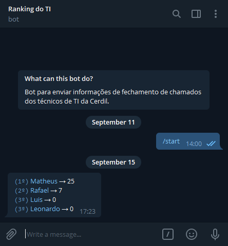

# glpi-ranking-bot-py

Telegram bot para enviar ranking dos técnicos que mais fecharam chamados no GLPi.

*Esse é um remake em Python da versão em PHP feita em julho de 2019.*

Testado na versão 9.2 do GLPi.



## Download

```bash
$ git clone https://github.com/theuves/glpi-ranking-bot-py.git
$ cd glpi-ranking-bot-py
```

## Instalação das dependências

```bash
pip install -r requirements.txt
```

## Configurações

### Dados sensíveis

Crie um arquivo `config.py` na raiz do projeto.

```python
#
# GLPi
#

GLPI_BASE_URL = "https://glpi.example.org"

GLPI_TOKEN = "xxxxxxxxxxxxxxxxxxxxxxxxxxxxxxxxxxxxxxxx"

GLPI_LOGIN_USER = "fulano.silva"

GLPI_TOKEN_PASSWORD = "mySecretPassword"

GLPI_USERS = [
  { "name": "Fulano", "id": 1 },
  { "name": "Sicrano", "id": 42 },
  { "name": "Beltrano", "id": 2743 }
]

#
# Telegram
#

TG_TOKEN = "999999999:xxxxxxxxxxxxxxxxxxxxxxxxxxxxxxxxxxx"

TG_CHAT_IDS = [
  "999999999"
]
```

### Envio das mensagens

Para o envio das mensagens você pode utilizar o CRON (agendador de tarefas do Linux).

Por exemplo, para enviar todo dia as 12 e 18 horas.

```
0 12 * * * python /path/to/glpi-ranking-bot-py/ranking.py
0 18 * * * python /path/to/glpi-ranking-bot-py/ranking.py
```

## Licença

MIT
